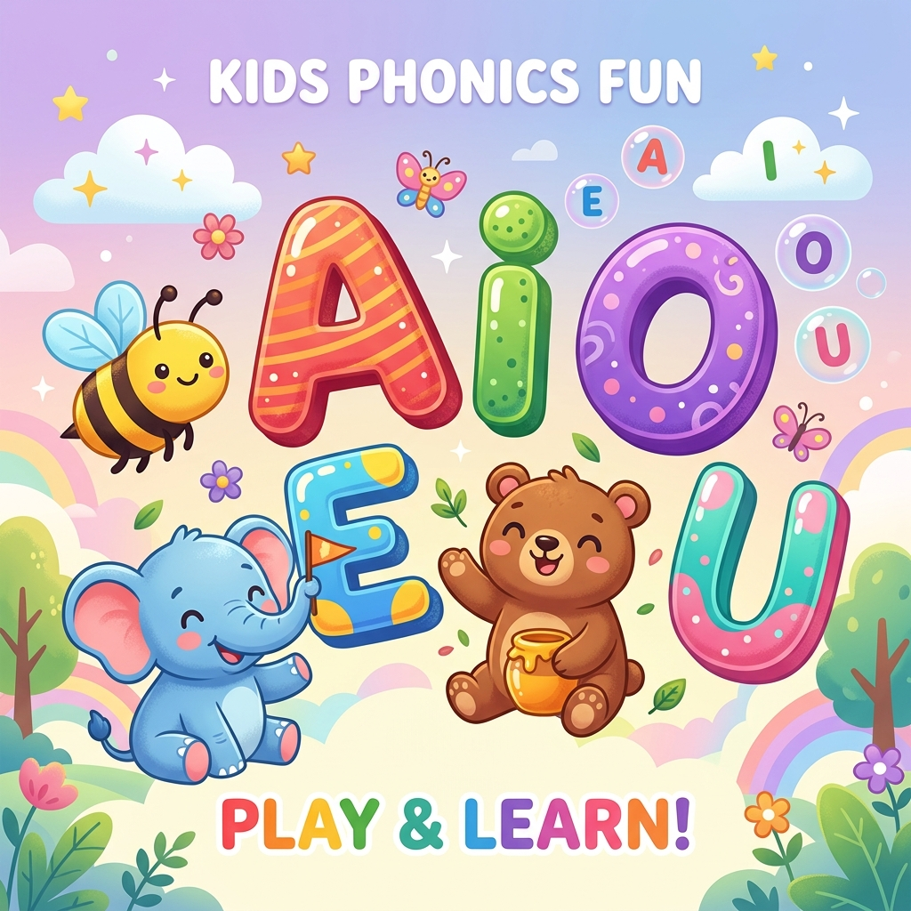
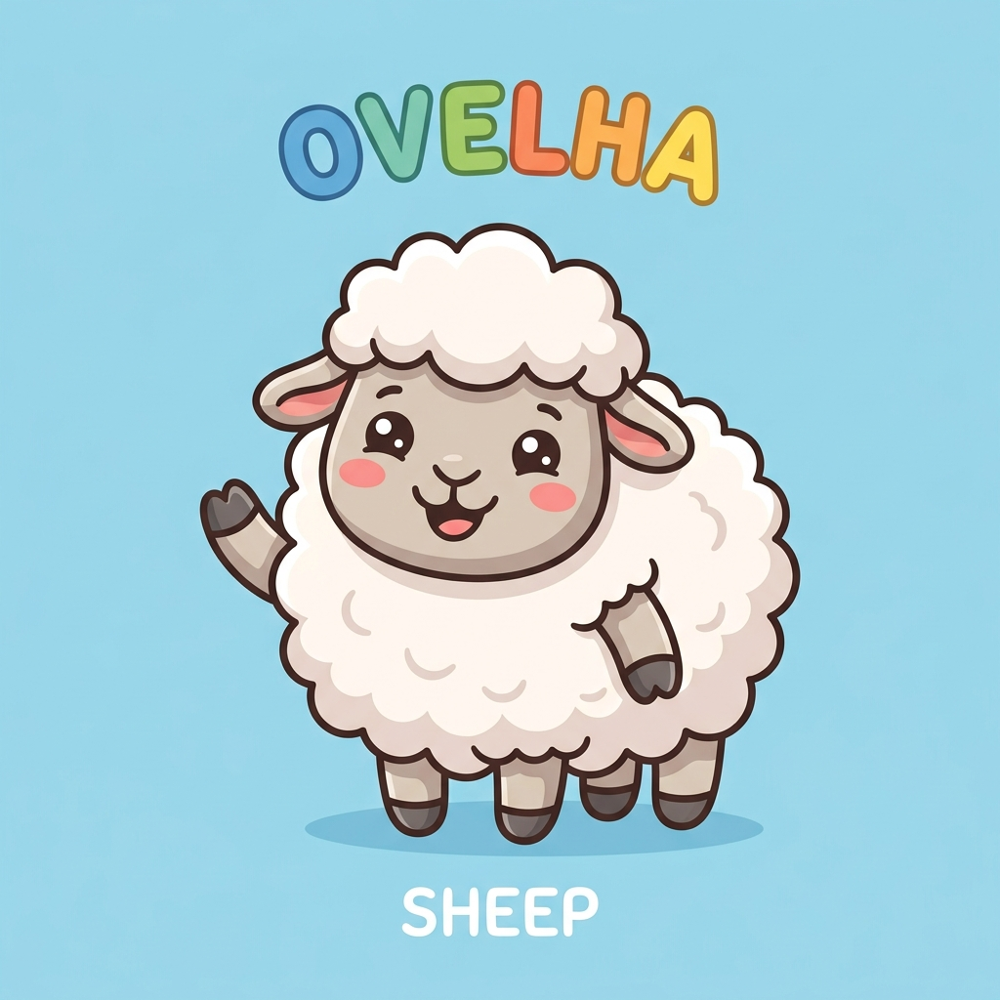
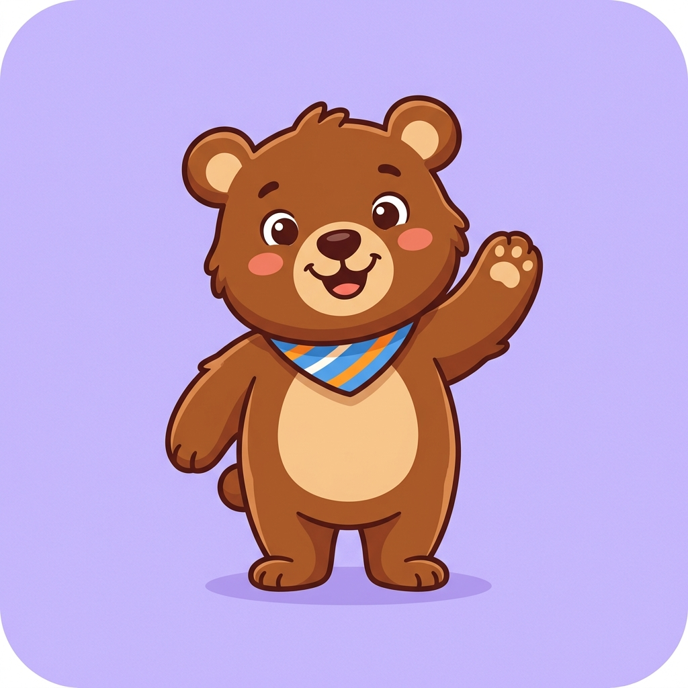

# 👶 VogaisApp - Brincar & Aprender 🦄

[](https://idiogolima.github.io/vogaisapp/)
[](https://idiogolima.github.io/vogaisapp/)

Um aplicativo educacional interativo, moderno e lúdico para o ensino de **vogais, números e cores** para crianças pequenas e bebês. Desenvolvido com carinho para ensinar brincando, em **Português e Inglês**!

👉 **[Acesse o Live Demo Aqui!](http://idiogolima.github.io/vogaisapp/)**

---

## 📸 Imagens do Aplicativo

### Capa Principal
<p align="center">
  
</p>

### Ilustrações Fofas das Vogais (Alfabeto)
<p align="center">
  
  
  
  
  
</p>

---

## 🌟 Recursos e Funcionalidades

O aplicativo agora é uma **SPA (Single Page Application)** leve, rápida e adaptada para celulares, tablets e computadores, contendo:

1. **🌎 Bilinguismo Completo (PT/EN):**
   - Alterne instantaneamente entre **Português** e **Inglês** no botão do topo. 
   - A pronúncia e as palavras fônicas mudam automaticamente (ex: *A de Abelha 🐝* em português vira *A for Apple 🍎* em inglês).

2. **🏷️ 3 Módulos de Aprendizagem:**
   - 📖 **Vogais:** Alfabeto fonético associado a ilustrações de animais/objetos.
   - 🔢 **Números:** Contagem de 1 a 10 com a quantidade e gênero fônico corretos (ex: *"Uma Maçã"*, *"Duas Bananas"*).
   - 🎨 **Cores:** Narração de cores associada a objetos contextuais (ex: *"O sol é amarelo"*, *"A uva é roxa"*).

3. **🎮 4 Modos de Jogos Interativos:**
   - 📖 **Aprender:** Slides de exploração com narrações humanas em alta qualidade.
   - 🎈 **Qual é a Vogal? (Quiz):** Um divertido jogo onde a criança deve estourar o balão flutuante correto baseado no som que acabou de ouvir.
   - 🧠 **Jogo da Memória:** Combinação de pares lógicos (ex: o número "3" casa com "Peixes 🐟🐟🐟"). O jogo sorteia 5 pares aleatórios a cada rodada, mantendo o visual limpo para celulares.
   - ✏️ **Desenhar:** Uma prancha de giz com pincéis coloridos para treinar o traçado guiado pontilhado das letras/números, ou desenho livre no modo Cores.

4. **📲 Suporte PWA (Funciona Offline):**
   - Instale como um aplicativo no seu celular (Android ou iOS).
   - Funciona **totalmente offline** sem precisar de internet, utilizando o Service Worker para cachear todos os assets, imagens e os 40 áudios humanos.

---

## 🛠️ Tecnologias Utilizadas

- **HTML5:** Estrutura semântica e Canvas interativo.
- **CSS3:** Animações fluidas (*bounce*, flutuação de balões, giros de cartas), design responsivo e variáveis dinâmicas.
- **JavaScript (Vanilla):** Lógica dos jogos, manipulação do Canvas de desenho, sistema de confetes e PWA.
- **Áudios de Alta Qualidade:** Narrações humanas completas gravadas em MP3 para todas as palavras.
- **PWA Manifest & Service Worker:** Suporte a cache offline.

---

## 🚀 Como Executar Localmente

Abra a pasta do projeto no seu terminal e execute:

```bash
# Se tiver Python instalado
python3 -m http.server 8000

# Se tiver Node instalado
npx http-server -p 8000
```
Depois acesse `http://localhost:8000` no seu navegador.
